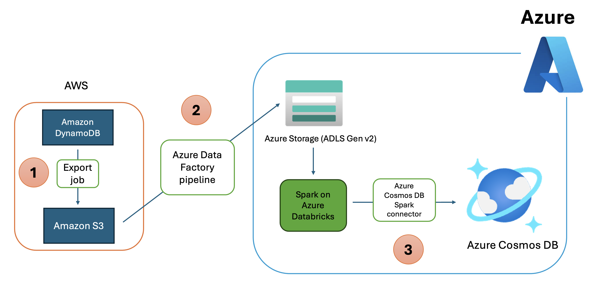

# Data migration from DynamoDB to Azure Cosmos DB for NoSQL

There are various migration strategies available; two frequently utilized techniques are *offline* and *online* migration. The selection should be based on your specific requirements. Choose offline migration, if your application can be temporarily stopped during a maintenance window, data migration can be performed in offline mode by exporting the data from DynamoDB to an intermediate location, and then importing it into Azure Cosmos DB.

This repository contains artifacts that can be used to execute offline migration of DynamoDB data to Azure Cosmos DB for NoSQL using Azure Data Factory, Azure Data Lake Storage, and Spark on Azure Databricks.

It has the following artifacts:

1. The Azure Data Factory pipeline template to copy data from S3 to Azure Data Lake Storage.
2. The Spark notebook to read data from Azure Data Lake Storage and write to Azure Cosmos DB using the Cosmos DB Spark connector. It also demonstrates how to use Microsoft Entra ID authentication to:
   1. Read data from Azure Data Lake Storage, and
   2. Write data to Azure Cosmos DB

1. Data from DynamoDB table is exported to S3 (in DynamoDB JSON format) using native DynamoDB export capability.
2. The DynamoDB table data in S3 is written to Azure Data Lake Storage (ADLS Gen v2) using an Azure Data Factory pipeline.
3. Finally, data in Azure storage is processed using Spark on Azure Databricks and written to Azure Cosmos DB.

## Contributing

This project welcomes contributions and suggestions.  Most contributions require you to agree to a
Contributor License Agreement (CLA) declaring that you have the right to, and actually do, grant us
the rights to use your contribution. For details, visit https://cla.opensource.microsoft.com.

When you submit a pull request, a CLA bot will automatically determine whether you need to provide
a CLA and decorate the PR appropriately (e.g., status check, comment). Simply follow the instructions
provided by the bot. You will only need to do this once across all repos using our CLA.

This project has adopted the [Microsoft Open Source Code of Conduct](https://opensource.microsoft.com/codeofconduct/).
For more information see the [Code of Conduct FAQ](https://opensource.microsoft.com/codeofconduct/faq/) or
contact [opencode@microsoft.com](mailto:opencode@microsoft.com) with any additional questions or comments.

## Trademarks

This project may contain trademarks or logos for projects, products, or services. Authorized use of Microsoft 
trademarks or logos is subject to and must follow 
[Microsoft's Trademark & Brand Guidelines](https://www.microsoft.com/en-us/legal/intellectualproperty/trademarks/usage/general).
Use of Microsoft trademarks or logos in modified versions of this project must not cause confusion or imply Microsoft sponsorship.
Any use of third-party trademarks or logos are subject to those third-party's policies.
